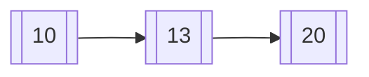

# Implémentation d’une liste chainée

est une structure permettant d'implémenter une liste, c'est-à-dire une séquence finie de valeurs (de même type ou non). Les éléments sont dits chainés car à chaque élément est associé l'adresse mémoire de l'élément suivant de la liste.


On a représente ici une liste chainée de trois éléments :



* Le premier est `10` et il pointe vers l'adresse mémoire du second ;
* deuxième élément est  `13` et il pointe vers l'adresse mémoire du troisième ;
* Le troisième élément est  `20` et Il ne pointe vers rien **(l'adresse du suivant est NULL)**. nous avons donc atteint la fin de la liste.


Les différentes functions suivantes ont été implémentées pour manipuler la liste (Voir header file):

* `insert_value_at_start`
* `insert_value_at_end`
* `insert_after`
* `delete_node`
* `destory_list`
* `display_list`


```c
#include <stdlib.h>
#include <stdio.h>
#include <stdbool.h>
#include "list.h"
#define MAX_SIZE 100

typedef struct Node {
  int value;
  struct Node *next;
} Node;

typedef struct List {
  Node *head;
  Node *tail;
  int size;
} List;

List_t new_list() {
  List_t list = malloc(sizeof(List));
  list->head = NULL;
  list->tail = NULL;
  list->size = 0;
  return list;
}


Node_t create_node(int element) {
  Node_t new_node = malloc(sizeof(Node));
  new_node->value = element;
  new_node->next = NULL;
  return new_node;
}


void insert_value_at_start(List_t list, int value) {
  Node_t new_node = create_node(value);

  if (list == NULL) {
    printf("Liste invalide (null)\n");
    return;
  }

  if (list->head == NULL) {
    list->head = new_node;
    list->tail = new_node;
  }else {
    new_node->next = list->head;
    list->head = new_node;
  }
  list->size++;
}


void insert_value_at_end(List_t list, int value) {
  Node_t new_node = create_node(value);
  if (list->tail == NULL) {
    list->head = new_node;
    list->tail = new_node;
  }else {
    list->tail->next = new_node;
    list->tail = new_node;
  }
  list->size++;
}

void insert_after(List_t list, Node_t prev_node, int value) {

  if (list == NULL) {
    printf("Liste invalide (null)\n");
  }

  if (prev_node == NULL) {
    printf("Error in insert_after\n");
    return;
  }

  Node_t new_node = create_node(value);
  new_node->next = prev_node->next;
  prev_node->next = new_node;

  if (prev_node == list->tail) {
    list->tail = new_node;
  }
  list->size++;
}

Node_t find_node(List_t list, int value) {

  Node_t current_value = list->head;

  while (current_value != NULL) {
    if (current_value->value == value) {
      return current_value;
    }
    current_value = current_value->next;
  }
  return NULL;
}

void display_list(List_t list) {
  Node_t current = list->head;
  printf("size %d \n", list->size);
  while (current != NULL) {
    printf("%d -> ", current->value);
    current = current->next;
  }
}


void destroy_list(List_t list) {
  Node_t current_node = list->head;
  Node_t next_node = NULL;

  while (current_node != NULL) {
    next_node = current_node->next;
    free(current_node);
    current_node = next_node;
  }

  free(list);
}

int main(){


    printf("Insérer dans une liste invalide (NULL)\n");
    insert_value_at_start(NULL,100);
    printf("---------------\n");

    printf("Initialisé une liste\n");
    List_t list = new_list();

    printf("Insértion at end : 3 \n");
    insert_value_at_end(list, 3);
    display_list(list);
    printf("\n---------------\n");

    printf("Insértion at end : 4 \n");
    insert_value_at_end(list, 4);
    display_list(list);
    printf("\n---------------\n");

    printf("Insértion at end : 6 \n");
    insert_value_at_end(list, 6);
    display_list(list);
    printf("\n---------------\n");

    printf("Insértion at start : 2 \n");
    insert_value_at_start(list, 2);
    display_list(list);
    printf("\n---------------\n");

    printf("Insértion at start : 1 \n");
    insert_value_at_start(list, 1);
    display_list(list);
    printf("\n---------------\n");

    display_list(list);


    printf("\n---------------\n");


    Node_t temp = find_node(list, 4);


    if (temp != NULL) {
      printf("Insértion 20 after: 4 \n");
      insert_after(list, temp, 20);
    }

    display_list(list);

    printf("\n---------------\n");

    printf("\nDestroy list -> OK\n");
    destroy_list(list);

    return 0;
}
```


### Voici un exemple d'exécution de la liste chainée :

```txt

Insérer dans une liste invalide (NULL)
Liste invalide (null)
---------------
Initialisé une liste
Insértion at end : 3 
size 1 
3 -> 
---------------
Insértion at end : 4 
size 2 
3 -> 4 -> 
---------------
Insértion at end : 6 
size 3 
3 -> 4 -> 6 -> 
---------------
Insértion at start : 2 
size 4 
2 -> 3 -> 4 -> 6 -> 
---------------
Insértion at start : 1 
size 5 
1 -> 2 -> 3 -> 4 -> 6 -> 
---------------
Insértion 20 after: 4 
size 6 
1 -> 2 -> 3 -> 4 -> 20 -> 6 -> 
---------------

Destroy list -> OK

Process finished with exit code 0

```